# AI Pipeline Architecture Documentation

## Table of Contents
1. [System Overview](#system-overview)
2. [Component Architecture](#component-architecture)
3. [Data Flow](#data-flow)
4. [Agent Architecture](#agent-architecture)
5. [Infrastructure Design](#infrastructure-design)
6. [Deployment Architecture](#deployment-architecture)
7. [Security Architecture](#security-architecture)
8. [Testing Strategy](#testing-strategy)
9. [Scalability Considerations](#scalability-considerations)
10. [Monitoring & Observability](#monitoring--observability)

## System Overview

The AI Pipeline is a **multi-agent bug report triage system** that automatically processes, analyzes, and creates GitHub issues from bug reports using AI-powered agents communicating through Apache Kafka.

### High-Level Architecture

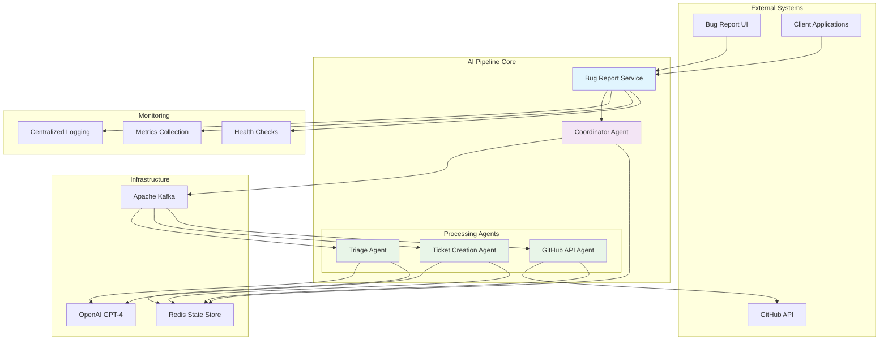

### Core Design Principles

- **Event-Driven Architecture**: Asynchronous processing using Kafka messaging
- **Agent-Based Design**: Specialized agents for different processing stages
- **Stateful Processing**: Redis-based state management for reliability
- **AI-Powered Intelligence**: OpenAI integration for intelligent analysis
- **Fault Tolerance**: Comprehensive error handling and recovery mechanisms
- **Horizontal Scalability**: Consumer groups and agent distribution
- **Observability**: Extensive logging, metrics, and health monitoring

## Component Architecture

### Core Components Overview

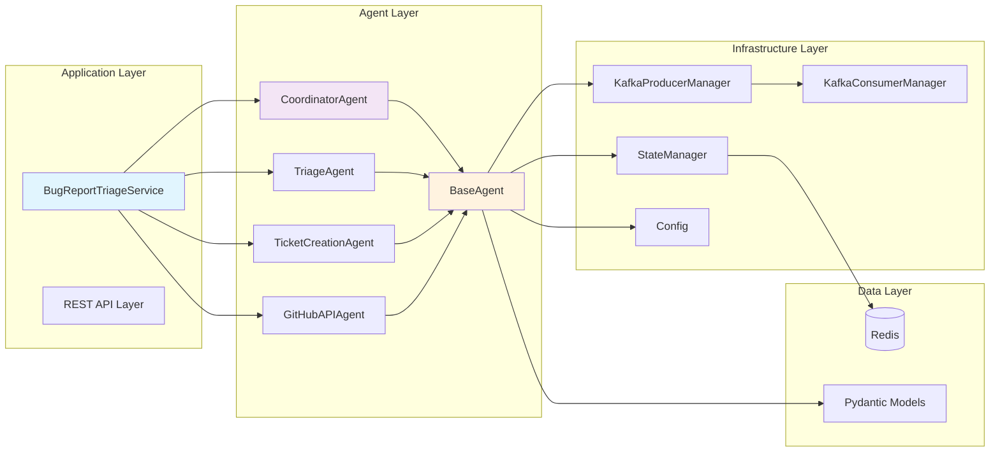

### Detailed Component Breakdown

#### 1. Bug Report Triage Service (Main Orchestrator)
- **Purpose**: Central service coordinator and entry point
- **Responsibilities**:
  - Initialize and manage all agents
  - Handle service lifecycle (start/stop)
  - Provide external API interfaces
  - Coordinate graceful shutdown
  - Health monitoring

#### 2. Agent Architecture
Each agent inherits from `BaseAgent` and provides specialized functionality:

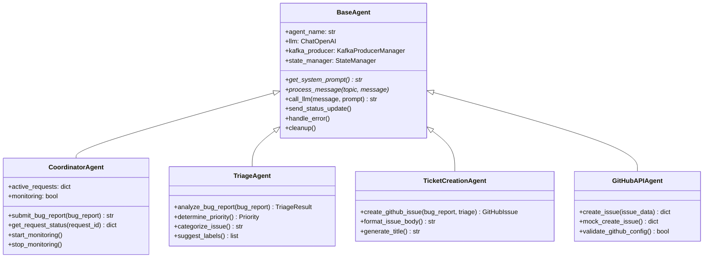

## Data Flow

### Complete Processing Workflow

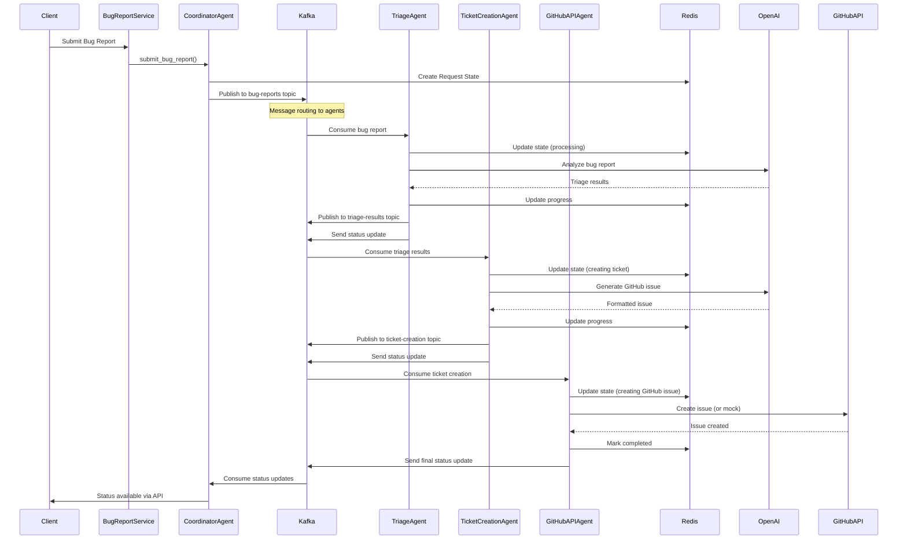

### Data Models Flow

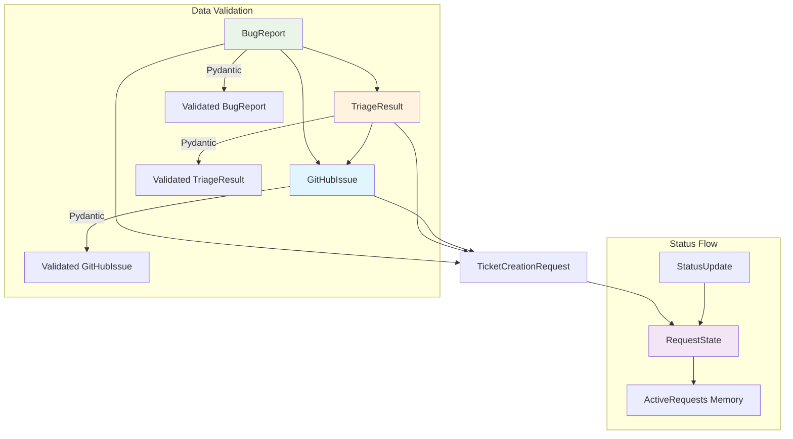

## Agent Architecture

### Agent Communication Pattern

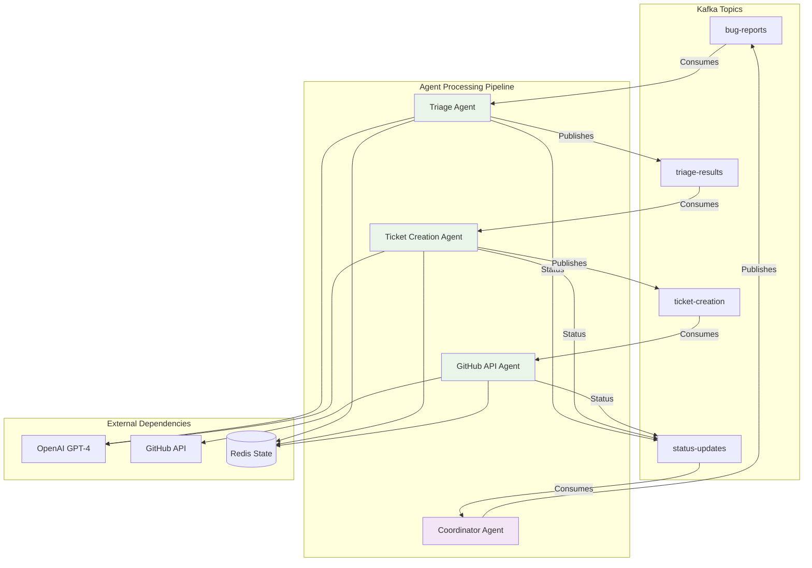

### Agent State Management

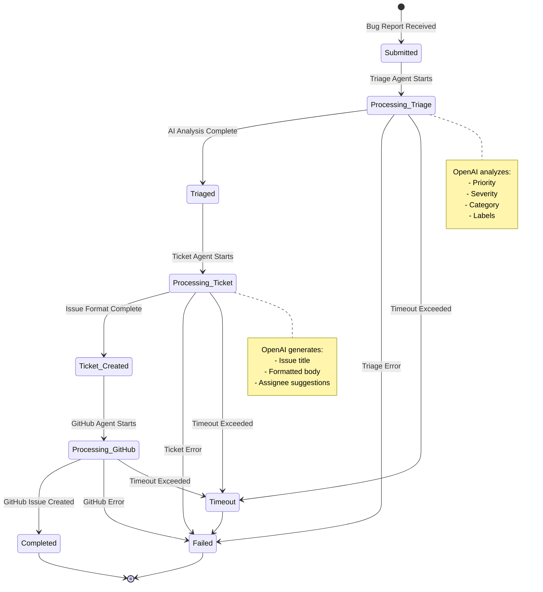

## Infrastructure Design

### Kafka Topic Architecture

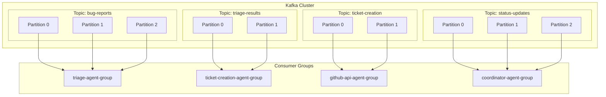

### Redis State Structure

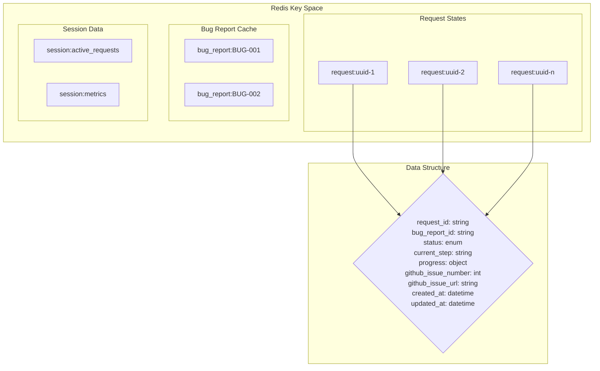

## Deployment Architecture

### Container Architecture

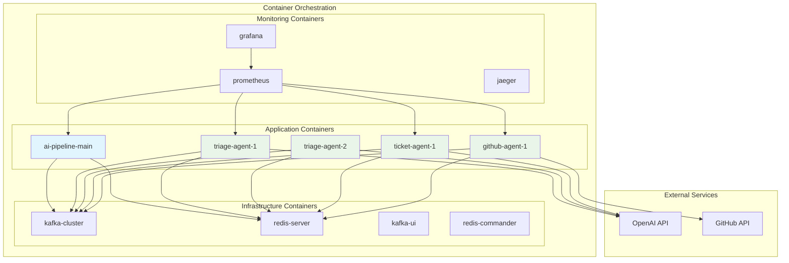

### Network Architecture

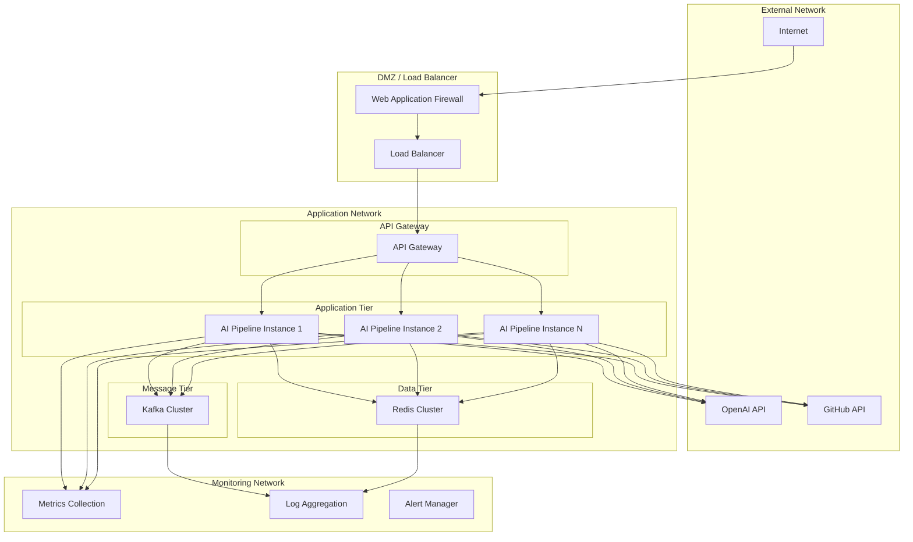

## Security Architecture

### Security Layers

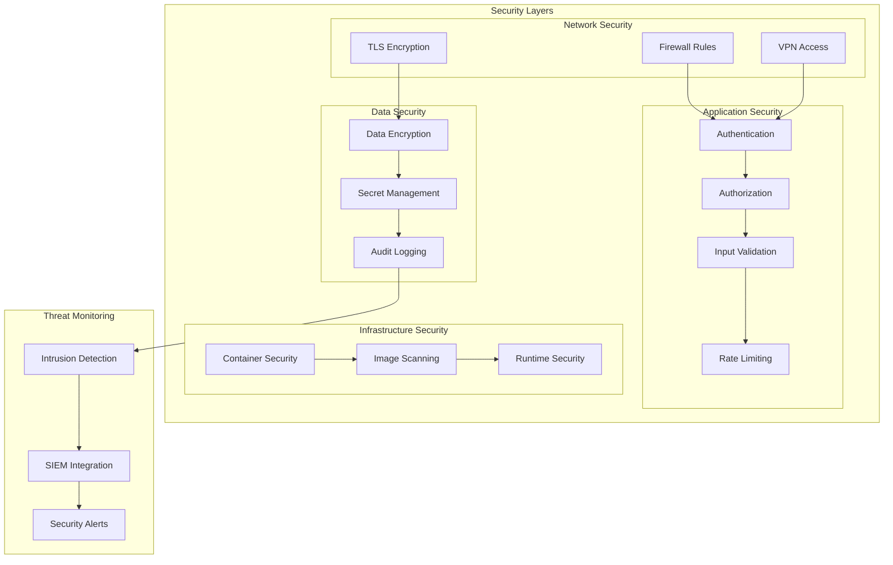

## Testing Strategy

### Test Architecture

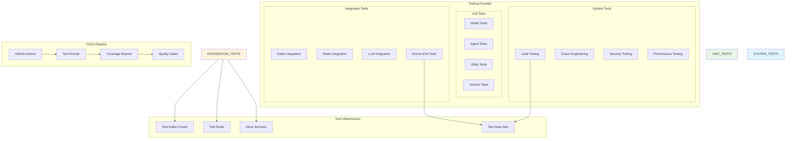

### Test Flow Diagram

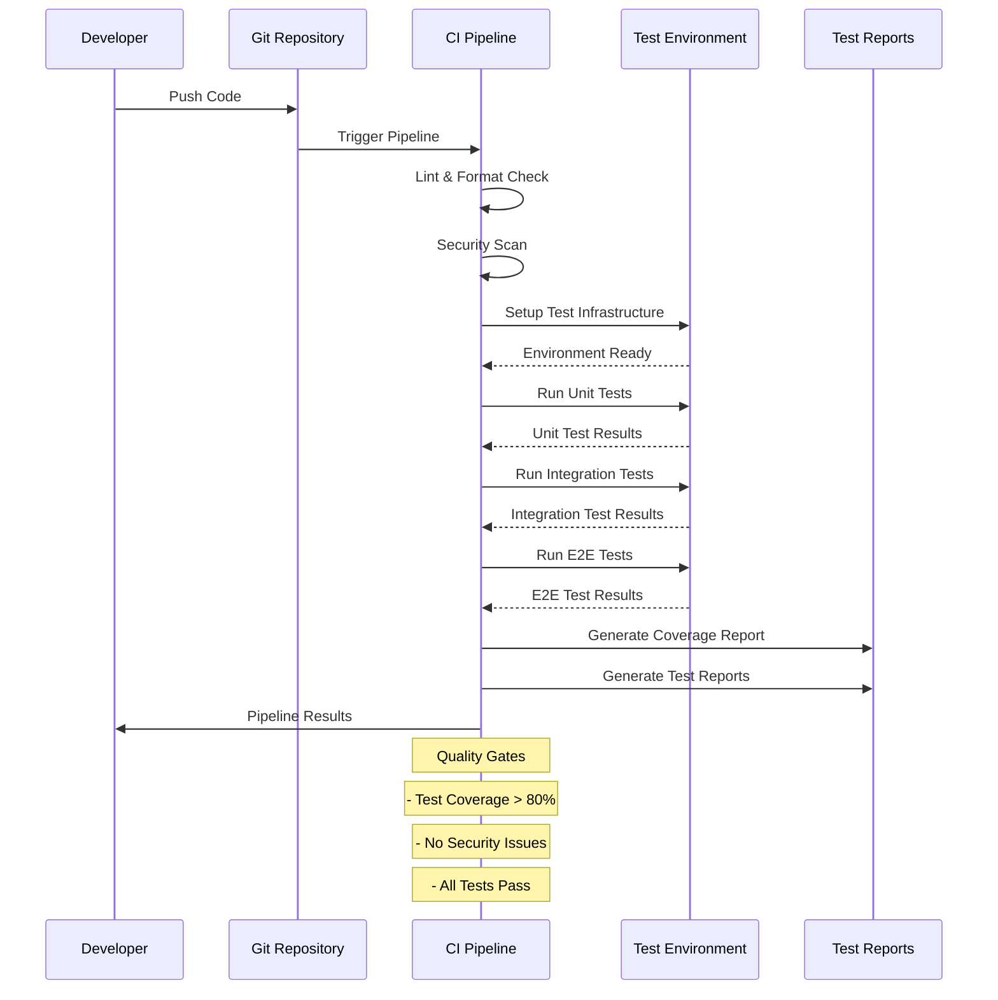

## Scalability Considerations

### Horizontal Scaling Pattern

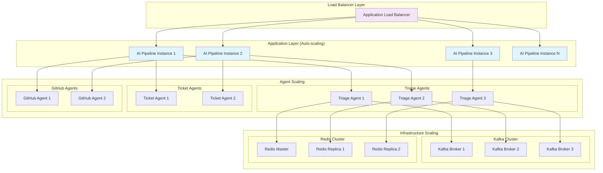

## Monitoring & Observability

### Observability Architecture

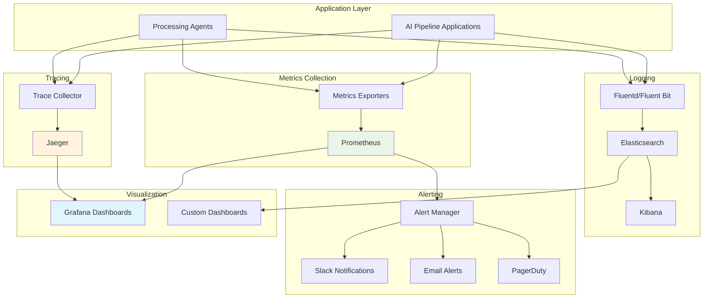

### Key Metrics Dashboard

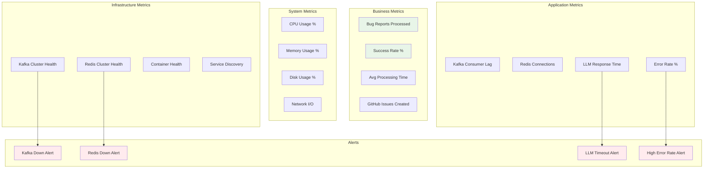

---

## Architecture Decision Records (ADRs)

### ADR-001: Multi-Agent Architecture
**Decision**: Use a multi-agent architecture with specialized agents for different processing stages.

**Context**: Need to process bug reports through multiple stages with different requirements.

**Consequences**:
- ✅ Clear separation of concerns
- ✅ Independent scaling of agents
- ✅ Easier testing and maintenance
- ❌ Increased complexity in coordination

### ADR-002: Apache Kafka for Messaging
**Decision**: Use Apache Kafka for inter-agent communication.

**Context**: Need reliable, scalable message passing between agents.

**Consequences**:
- ✅ High throughput and reliability
- ✅ Built-in partitioning and scaling
- ✅ Message durability and replay
- ❌ Additional operational complexity

### ADR-003: Redis for State Management
**Decision**: Use Redis for centralized state management.

**Context**: Need fast, reliable state storage for request tracking.

**Consequences**:
- ✅ Fast in-memory performance
- ✅ Rich data structures
- ✅ Persistence options
- ❌ Memory limitations for large datasets

### ADR-004: OpenAI GPT-4 for AI Processing
**Decision**: Use OpenAI GPT-4 for intelligent bug report analysis.

**Context**: Need high-quality AI analysis for triage and ticket generation.

**Consequences**:
- ✅ State-of-the-art language understanding
- ✅ Well-documented API
- ✅ Reliable service
- ❌ External dependency and cost
- ❌ Rate limiting considerations

---

This architecture documentation provides a comprehensive overview of the AI Pipeline system design, covering all major aspects from high-level architecture to detailed implementation considerations.
