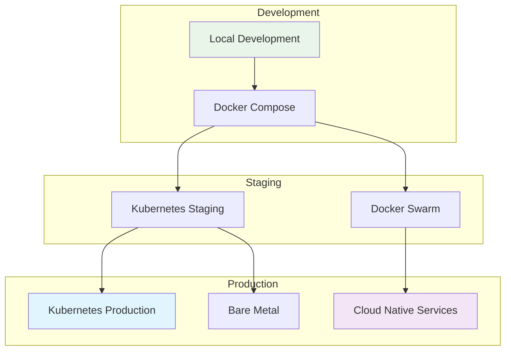
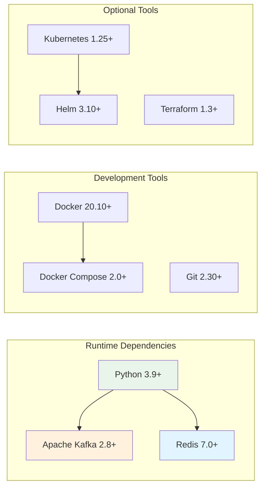
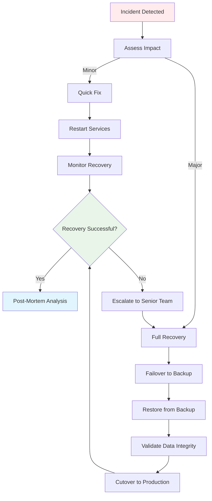

# AI Pipeline Deployment Guide

## Table of Contents
1. [Deployment Overview](#deployment-overview)
2. [Environment Requirements](#environment-requirements)
3. [Local Development Setup](#local-development-setup)
4. [Production Deployment](#production-deployment)
5. [Container Orchestration](#container-orchestration)
6. [Infrastructure as Code](#infrastructure-as-code)
7. [Monitoring Setup](#monitoring-setup)
8. [Security Configuration](#security-configuration)
9. [Backup and Recovery](#backup-and-recovery)
10. [Troubleshooting](#troubleshooting)

## Deployment Overview

The AI Pipeline supports multiple deployment strategies:



## Environment Requirements

### Minimum System Requirements

| Component | Development | Staging | Production |
|-----------|-------------|---------|------------|
| CPU | 2 cores | 4 cores | 8+ cores |
| RAM | 4 GB | 8 GB | 16+ GB |
| Storage | 20 GB | 50 GB | 100+ GB |
| Network | 100 Mbps | 1 Gbps | 10+ Gbps |

### Software Dependencies



## Local Development Setup

### Quick Start with Docker Compose

1. **Clone Repository**
   ```bash
   git clone https://github.com/ianlintner/AI-Pipeline.git
   cd AI-Pipeline
   ```

2. **Environment Configuration**
   ```bash
   cp .env.example .env
   # Edit .env with your configuration
   nano .env
   ```

3. **Start Services**
   ```bash
   # Start infrastructure only
   docker-compose up -d kafka redis kafka-ui redis-commander
   
   # OR start everything
   docker-compose up -d
   ```

4. **Verify Setup**
   ```bash
   # Check service health
   curl http://localhost:8000/api/v1/health
   
   # Access UIs
   # Kafka UI: http://localhost:8080
   # Redis Commander: http://localhost:8081
   ```

### Manual Setup

1. **Install Python Dependencies**
   ```bash
   python -m venv venv
   source venv/bin/activate  # On Windows: venv\Scripts\activate
   pip install -r requirements.txt
   ```

2. **Start Infrastructure Services**
   ```bash
   # Start Kafka
   docker run -d --name kafka \
     -p 9092:9092 \
     -e KAFKA_ZOOKEEPER_CONNECT=localhost:2181 \
     -e KAFKA_ADVERTISED_LISTENERS=PLAINTEXT://localhost:9092 \
     confluentinc/cp-kafka:latest
   
   # Start Redis
   docker run -d --name redis \
     -p 6379:6379 \
     redis:alpine
   ```

3. **Run Application**
   ```bash
   python bug_report_service.py
   ```

## Production Deployment

### Kubernetes Deployment

#### Namespace and ConfigMap

```yaml
# k8s/namespace.yaml
apiVersion: v1
kind: Namespace
metadata:
  name: ai-pipeline
  labels:
    name: ai-pipeline
---
apiVersion: v1
kind: ConfigMap
metadata:
  name: ai-pipeline-config
  namespace: ai-pipeline
data:
  KAFKA_BOOTSTRAP_SERVERS: "kafka-cluster:9092"
  REDIS_URL: "redis://redis-cluster:6379"
  OPENAI_MODEL: "gpt-4"
  MAX_RETRIES: "3"
  TIMEOUT_SECONDS: "300"
```

#### Secrets Management

```yaml
# k8s/secrets.yaml
apiVersion: v1
kind: Secret
metadata:
  name: ai-pipeline-secrets
  namespace: ai-pipeline
type: Opaque
data:
  OPENAI_API_KEY: <base64-encoded-key>
  GITHUB_API_TOKEN: <base64-encoded-token>
```

#### Application Deployment

```yaml
# k8s/deployment.yaml
apiVersion: apps/v1
kind: Deployment
metadata:
  name: ai-pipeline
  namespace: ai-pipeline
spec:
  replicas: 3
  selector:
    matchLabels:
      app: ai-pipeline
  template:
    metadata:
      labels:
        app: ai-pipeline
    spec:
      containers:
      - name: ai-pipeline
        image: ai-pipeline:latest
        ports:
        - containerPort: 8000
        env:
        - name: KAFKA_BOOTSTRAP_SERVERS
          valueFrom:
            configMapKeyRef:
              name: ai-pipeline-config
              key: KAFKA_BOOTSTRAP_SERVERS
        - name: REDIS_URL
          valueFrom:
            configMapKeyRef:
              name: ai-pipeline-config
              key: REDIS_URL
        - name: OPENAI_API_KEY
          valueFrom:
            secretKeyRef:
              name: ai-pipeline-secrets
              key: OPENAI_API_KEY
        resources:
          requests:
            memory: "512Mi"
            cpu: "250m"
          limits:
            memory: "1Gi"
            cpu: "500m"
        livenessProbe:
          httpGet:
            path: /api/v1/health
            port: 8000
          initialDelaySeconds: 30
          periodSeconds: 10
        readinessProbe:
          httpGet:
            path: /api/v1/health
            port: 8000
          initialDelaySeconds: 5
          periodSeconds: 5
```

#### Service and Ingress

```yaml
# k8s/service.yaml
apiVersion: v1
kind: Service
metadata:
  name: ai-pipeline-service
  namespace: ai-pipeline
spec:
  selector:
    app: ai-pipeline
  ports:
  - protocol: TCP
    port: 80
    targetPort: 8000
  type: ClusterIP
---
apiVersion: networking.k8s.io/v1
kind: Ingress
metadata:
  name: ai-pipeline-ingress
  namespace: ai-pipeline
  annotations:
    nginx.ingress.kubernetes.io/rewrite-target: /
    cert-manager.io/cluster-issuer: letsencrypt-prod
spec:
  tls:
  - hosts:
    - api.ai-pipeline.example.com
    secretName: ai-pipeline-tls
  rules:
  - host: api.ai-pipeline.example.com
    http:
      paths:
      - path: /
        pathType: Prefix
        backend:
          service:
            name: ai-pipeline-service
            port:
              number: 80
```

### Helm Chart Deployment

```yaml
# helm/ai-pipeline/values.yaml
replicaCount: 3

image:
  repository: ai-pipeline
  tag: latest
  pullPolicy: IfNotPresent

service:
  type: ClusterIP
  port: 80
  targetPort: 8000

ingress:
  enabled: true
  annotations:
    kubernetes.io/ingress.class: nginx
    cert-manager.io/cluster-issuer: letsencrypt-prod
  hosts:
    - host: api.ai-pipeline.example.com
      paths:
        - path: /
          pathType: Prefix
  tls:
    - secretName: ai-pipeline-tls
      hosts:
        - api.ai-pipeline.example.com

resources:
  requests:
    memory: 512Mi
    cpu: 250m
  limits:
    memory: 1Gi
    cpu: 500m

autoscaling:
  enabled: true
  minReplicas: 3
  maxReplicas: 10
  targetCPUUtilizationPercentage: 70
  targetMemoryUtilizationPercentage: 80

config:
  kafka:
    bootstrapServers: "kafka-cluster:9092"
  redis:
    url: "redis://redis-cluster:6379"
  openai:
    model: "gpt-4"
    timeout: 300

secrets:
  openapiKey: ""
  githubToken: ""

kafka:
  enabled: true
  replicaCount: 3
  persistence:
    enabled: true
    size: 10Gi

redis:
  enabled: true
  persistence:
    enabled: true
    size: 5Gi
```

## Container Orchestration

### Docker Swarm Deployment

```yaml
# docker-stack.yml
version: '3.8'

services:
  ai-pipeline:
    image: ai-pipeline:latest
    deploy:
      replicas: 3
      restart_policy:
        condition: on-failure
        delay: 5s
        max_attempts: 3
      update_config:
        parallelism: 1
        delay: 10s
        failure_action: rollback
      resources:
        limits:
          cpus: '0.5'
          memory: 1G
        reservations:
          cpus: '0.25'
          memory: 512M
    environment:
      - KAFKA_BOOTSTRAP_SERVERS=kafka:9092
      - REDIS_URL=redis://redis:6379
    secrets:
      - openai_api_key
      - github_token
    networks:
      - ai-pipeline-network
    ports:
      - "8000:8000"

  kafka:
    image: confluentinc/cp-kafka:latest
    deploy:
      replicas: 3
    environment:
      KAFKA_ZOOKEEPER_CONNECT: zookeeper:2181
      KAFKA_ADVERTISED_LISTENERS: PLAINTEXT://kafka:9092
    networks:
      - ai-pipeline-network
    volumes:
      - kafka_data:/var/lib/kafka/data

  redis:
    image: redis:alpine
    deploy:
      replicas: 1
    networks:
      - ai-pipeline-network
    volumes:
      - redis_data:/data

networks:
  ai-pipeline-network:
    driver: overlay
    attachable: true

volumes:
  kafka_data:
  redis_data:

secrets:
  openai_api_key:
    external: true
  github_token:
    external: true
```

## Infrastructure as Code

### Terraform Configuration

```hcl
# terraform/main.tf
terraform {
  required_version = ">= 1.3"
  required_providers {
    aws = {
      source  = "hashicorp/aws"
      version = "~> 5.0"
    }
    kubernetes = {
      source  = "hashicorp/kubernetes"
      version = "~> 2.16"
    }
  }
}

provider "aws" {
  region = var.aws_region
}

# EKS Cluster
module "eks" {
  source = "terraform-aws-modules/eks/aws"
  
  cluster_name    = "ai-pipeline-cluster"
  cluster_version = "1.28"
  
  vpc_id     = module.vpc.vpc_id
  subnet_ids = module.vpc.private_subnets
  
  node_groups = {
    ai_pipeline = {
      desired_capacity = 3
      max_capacity     = 10
      min_capacity     = 3
      
      instance_types = ["t3.medium"]
      
      k8s_labels = {
        Environment = var.environment
        Application = "ai-pipeline"
      }
    }
  }
}

# VPC Configuration
module "vpc" {
  source = "terraform-aws-modules/vpc/aws"
  
  name = "ai-pipeline-vpc"
  cidr = "10.0.0.0/16"
  
  azs             = ["${var.aws_region}a", "${var.aws_region}b", "${var.aws_region}c"]
  private_subnets = ["10.0.1.0/24", "10.0.2.0/24", "10.0.3.0/24"]
  public_subnets  = ["10.0.101.0/24", "10.0.102.0/24", "10.0.103.0/24"]
  
  enable_nat_gateway = true
  enable_vpn_gateway = true
  
  tags = {
    Environment = var.environment
    Application = "ai-pipeline"
  }
}

# RDS for Redis Alternative (ElastiCache)
resource "aws_elasticache_cluster" "redis" {
  cluster_id           = "ai-pipeline-redis"
  engine               = "redis"
  node_type           = "cache.t3.micro"
  num_cache_nodes     = 1
  parameter_group_name = "default.redis7"
  port                = 6379
  subnet_group_name   = aws_elasticache_subnet_group.redis.name
  security_group_ids  = [aws_security_group.redis.id]
  
  tags = {
    Environment = var.environment
    Application = "ai-pipeline"
  }
}

# MSK for Kafka
resource "aws_msk_cluster" "kafka" {
  cluster_name           = "ai-pipeline-kafka"
  kafka_version         = "2.8.1"
  number_of_broker_nodes = 3
  
  broker_node_group_info {
    instance_type   = "kafka.t3.small"
    ebs_volume_size = 20
    client_subnets  = module.vpc.private_subnets
    security_groups = [aws_security_group.kafka.id]
  }
  
  tags = {
    Environment = var.environment
    Application = "ai-pipeline"
  }
}
```

## Monitoring Setup

### Prometheus Configuration

```yaml
# monitoring/prometheus.yml
global:
  scrape_interval: 15s
  evaluation_interval: 15s

rule_files:
  - "alert_rules.yml"

scrape_configs:
  - job_name: 'ai-pipeline'
    static_configs:
      - targets: ['ai-pipeline:8000']
    metrics_path: '/metrics'
    scrape_interval: 10s

  - job_name: 'kafka'
    static_configs:
      - targets: ['kafka:9092']
    scrape_interval: 30s

  - job_name: 'redis'
    static_configs:
      - targets: ['redis:6379']
    scrape_interval: 30s

alerting:
  alertmanagers:
    - static_configs:
        - targets:
          - alertmanager:9093
```

### Grafana Dashboard

```json
{
  "dashboard": {
    "title": "AI Pipeline Metrics",
    "panels": [
      {
        "title": "Request Processing Rate",
        "type": "graph",
        "targets": [
          {
            "expr": "rate(ai_pipeline_requests_total[5m])",
            "legendFormat": "Requests/sec"
          }
        ]
      },
      {
        "title": "Success Rate",
        "type": "stat",
        "targets": [
          {
            "expr": "rate(ai_pipeline_requests_successful[5m]) / rate(ai_pipeline_requests_total[5m]) * 100",
            "legendFormat": "Success Rate %"
          }
        ]
      },
      {
        "title": "Processing Time",
        "type": "histogram",
        "targets": [
          {
            "expr": "histogram_quantile(0.95, ai_pipeline_processing_duration_seconds)",
            "legendFormat": "95th Percentile"
          }
        ]
      }
    ]
  }
}
```

## Security Configuration

### Network Security

```yaml
# k8s/network-policy.yaml
apiVersion: networking.k8s.io/v1
kind: NetworkPolicy
metadata:
  name: ai-pipeline-network-policy
  namespace: ai-pipeline
spec:
  podSelector:
    matchLabels:
      app: ai-pipeline
  policyTypes:
  - Ingress
  - Egress
  ingress:
  - from:
    - namespaceSelector:
        matchLabels:
          name: ingress-nginx
    ports:
    - protocol: TCP
      port: 8000
  egress:
  - to:
    - namespaceSelector:
        matchLabels:
          name: kafka
    ports:
    - protocol: TCP
      port: 9092
  - to:
    - namespaceSelector:
        matchLabels:
          name: redis
    ports:
    - protocol: TCP
      port: 6379
  - to: []
    ports:
    - protocol: TCP
      port: 443  # HTTPS for OpenAI/GitHub APIs
```

### Pod Security Policy

```yaml
# k8s/pod-security-policy.yaml
apiVersion: policy/v1beta1
kind: PodSecurityPolicy
metadata:
  name: ai-pipeline-psp
spec:
  privileged: false
  allowPrivilegeEscalation: false
  requiredDropCapabilities:
    - ALL
  volumes:
    - 'configMap'
    - 'emptyDir'
    - 'projected'
    - 'secret'
    - 'downwardAPI'
    - 'persistentVolumeClaim'
  runAsUser:
    rule: 'MustRunAsNonRoot'
  seLinux:
    rule: 'RunAsAny'
  fsGroup:
    rule: 'RunAsAny'
```

## Backup and Recovery

### Database Backup Strategy

```bash
#!/bin/bash
# scripts/backup-redis.sh

BACKUP_DIR="/backups/redis"
DATE=$(date +%Y%m%d_%H%M%S)
REDIS_HOST="redis-cluster"
REDIS_PORT="6379"

# Create backup directory
mkdir -p $BACKUP_DIR

# Backup Redis data
redis-cli -h $REDIS_HOST -p $REDIS_PORT --rdb $BACKUP_DIR/redis_backup_$DATE.rdb

# Compress backup
gzip $BACKUP_DIR/redis_backup_$DATE.rdb

# Cleanup old backups (keep last 7 days)
find $BACKUP_DIR -name "redis_backup_*.rdb.gz" -mtime +7 -delete

echo "Redis backup completed: redis_backup_$DATE.rdb.gz"
```

### Disaster Recovery Plan



## Troubleshooting

### Common Issues

#### Service Won't Start

```bash
# Check container logs
docker logs ai-pipeline

# Check resource usage
docker stats

# Verify network connectivity
docker exec ai-pipeline ping kafka
docker exec ai-pipeline ping redis
```

#### High Memory Usage

```bash
# Check memory usage by component
kubectl top pods -n ai-pipeline

# Scale horizontally
kubectl scale deployment ai-pipeline --replicas=5

# Increase memory limits
kubectl patch deployment ai-pipeline -p '{"spec":{"template":{"spec":{"containers":[{"name":"ai-pipeline","resources":{"limits":{"memory":"2Gi"}}}]}}}}'
```

#### Kafka Connection Issues

```bash
# Check Kafka cluster health
kubectl exec -it kafka-0 -- kafka-topics.sh --bootstrap-server localhost:9092 --list

# Verify topic creation
kubectl exec -it kafka-0 -- kafka-topics.sh --bootstrap-server localhost:9092 --create --topic bug-reports --partitions 3 --replication-factor 2
```

### Health Check Commands

```bash
# Application health
curl -f http://localhost:8000/api/v1/health || exit 1

# Kafka health
kafka-topics.sh --bootstrap-server kafka:9092 --list

# Redis health
redis-cli -h redis ping

# Database connectivity
redis-cli -h redis info replication
```

This deployment guide provides comprehensive instructions for deploying the AI Pipeline in various environments, from local development to production Kubernetes clusters.
