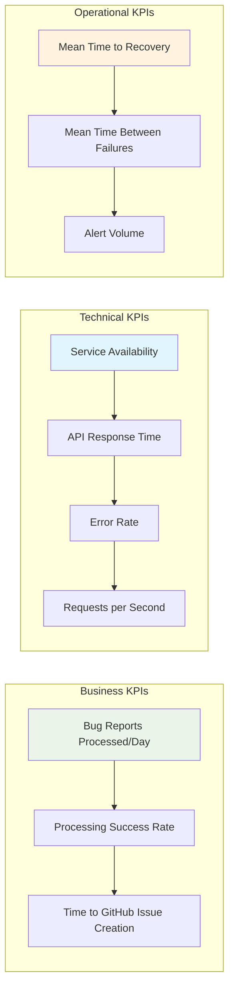
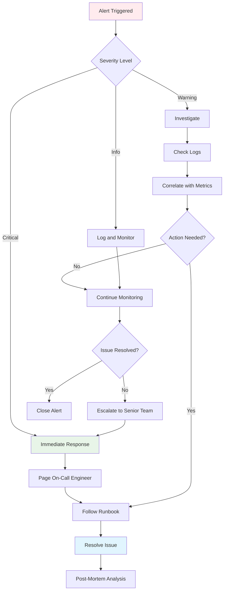
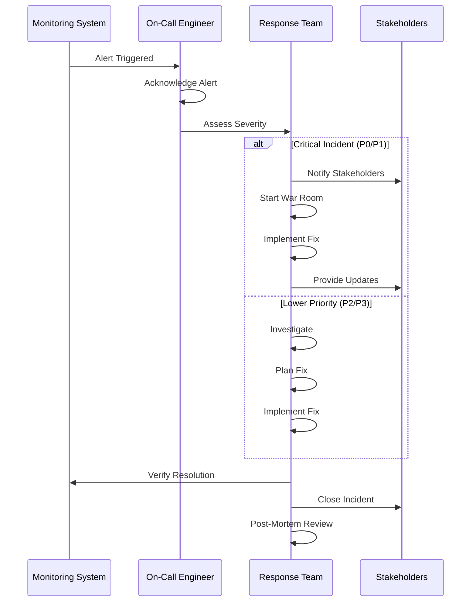
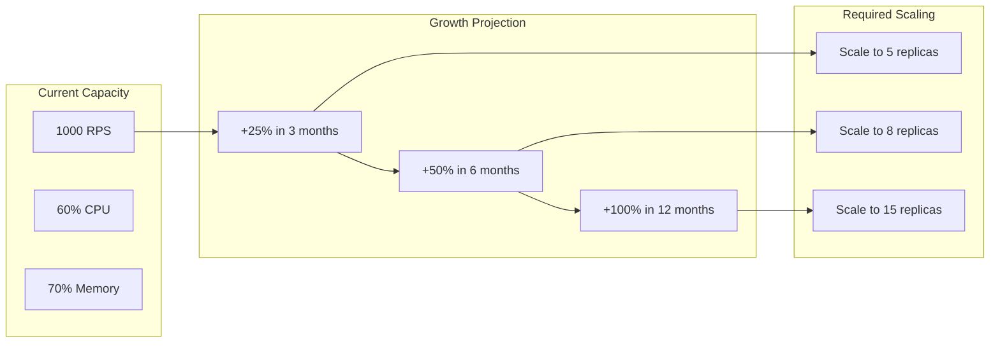
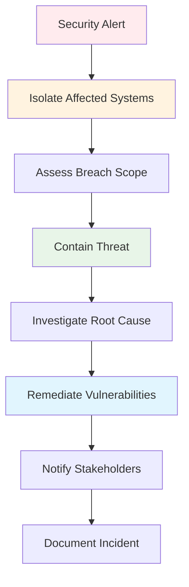

# AI Pipeline Operations Runbook

## Table of Contents
- [AI Pipeline Operations Runbook](#ai-pipeline-operations-runbook)
  - [Table of Contents](#table-of-contents)
  - [Overview](#overview)
    - [Service Level Objectives (SLOs)](#service-level-objectives-slos)
    - [Key Performance Indicators (KPIs)](#key-performance-indicators-kpis)
  - [Daily Operations](#daily-operations)
    - [Morning Health Check](#morning-health-check)
    - [Evening Summary Report](#evening-summary-report)
  - [Monitoring and Alerting](#monitoring-and-alerting)
    - [Critical Alerts](#critical-alerts)
      - [Service Down Alert](#service-down-alert)
      - [High Error Rate Alert](#high-error-rate-alert)
      - [Kafka Consumer Lag Alert](#kafka-consumer-lag-alert)
    - [Alerting Decision Tree](#alerting-decision-tree)
  - [Incident Response](#incident-response)
    - [Incident Classification](#incident-classification)
    - [Incident Response Flow](#incident-response-flow)
  - [Performance Tuning](#performance-tuning)
    - [CPU Optimization](#cpu-optimization)
    - [Memory Optimization](#memory-optimization)
    - [Kafka Performance Tuning](#kafka-performance-tuning)
  - [Capacity Planning](#capacity-planning)
    - [Traffic Forecasting](#traffic-forecasting)
    - [Resource Planning Script](#resource-planning-script)
  - [Maintenance Procedures](#maintenance-procedures)
    - [Rolling Updates](#rolling-updates)
    - [Database Maintenance](#database-maintenance)
  - [Security Operations](#security-operations)
    - [Security Monitoring](#security-monitoring)
    - [Incident Response Security](#incident-response-security)
  - [Backup and Recovery](#backup-and-recovery)
    - [Automated Backup Procedures](#automated-backup-procedures)
  - [Runbook Procedures](#runbook-procedures)
    - [Common Troubleshooting Commands](#common-troubleshooting-commands)
    - [Emergency Procedures](#emergency-procedures)
      - [Complete Service Recovery](#complete-service-recovery)

## Overview

This operations runbook provides step-by-step procedures for managing the AI Pipeline in production environments. It covers routine operations, incident response, and maintenance tasks.

### Service Level Objectives (SLOs)

| Metric | Target | Measurement |
|--------|---------|-------------|
| Availability | 99.9% | Monthly uptime |
| Response Time | < 2s | 95th percentile |
| Processing Time | < 5 minutes | End-to-end bug report processing |
| Error Rate | < 0.1% | Failed requests per total requests |
| Recovery Time | < 15 minutes | Time to restore service |

### Key Performance Indicators (KPIs)



## Daily Operations

### Morning Health Check

```bash
#!/bin/bash
# scripts/morning-health-check.sh

echo "=== AI Pipeline Daily Health Check ==="
echo "Date: $(date)"
echo

# 1. Check service health
echo "1. Checking service health..."
curl -s http://localhost:8000/api/v1/health | jq '.'
echo

# 2. Check active requests
echo "2. Checking active requests..."
ACTIVE_REQUESTS=$(curl -s http://localhost:8000/api/v1/requests | jq '.pagination.total')
echo "Active requests: $ACTIVE_REQUESTS"
echo

# 3. Check infrastructure
echo "3. Checking infrastructure..."
echo "Kafka topics:"
kafka-topics.sh --bootstrap-server kafka:9092 --list
echo
echo "Redis info:"
redis-cli info replication | head -5
echo

# 4. Check resource usage
echo "4. Checking resource usage..."
if command -v kubectl &> /dev/null; then
    kubectl top pods -n ai-pipeline
else
    docker stats --no-stream --format "table {{.Name}}\t{{.CPUPerc}}\t{{.MemUsage}}"
fi
echo

# 5. Check logs for errors
echo "5. Checking recent errors..."
if command -v kubectl &> /dev/null; then
    kubectl logs -n ai-pipeline deployment/ai-pipeline --since=24h | grep -i error | tail -5
else
    docker logs ai-pipeline --since=24h 2>&1 | grep -i error | tail -5
fi

echo "=== Health Check Complete ==="
```

### Evening Summary Report

```bash
#!/bin/bash
# scripts/evening-summary.sh

echo "=== AI Pipeline Daily Summary ==="
echo "Date: $(date -d yesterday)"
echo

# Get yesterday's metrics
YESTERDAY=$(date -d yesterday +%Y-%m-%d)

# 1. Processing metrics
echo "1. Processing Summary:"
echo "   - Bug reports processed: $(get_daily_metric 'requests_total' $YESTERDAY)"
echo "   - Success rate: $(get_daily_metric 'success_rate' $YESTERDAY)%"
echo "   - Average processing time: $(get_daily_metric 'avg_processing_time' $YESTERDAY)s"
echo

# 2. Error summary
echo "2. Error Summary:"
echo "   - Total errors: $(get_daily_metric 'errors_total' $YESTERDAY)"
echo "   - Error rate: $(get_daily_metric 'error_rate' $YESTERDAY)%"
echo

# 3. Performance metrics
echo "3. Performance Summary:"
echo "   - Average response time: $(get_daily_metric 'response_time_avg' $YESTERDAY)ms"
echo "   - 95th percentile: $(get_daily_metric 'response_time_p95' $YESTERDAY)ms"
echo

# 4. Infrastructure health
echo "4. Infrastructure Summary:"
echo "   - Kafka messages processed: $(get_daily_metric 'kafka_messages' $YESTERDAY)"
echo "   - Redis operations: $(get_daily_metric 'redis_operations' $YESTERDAY)"
echo "   - OpenAI API calls: $(get_daily_metric 'openai_calls' $YESTERDAY)"

echo "=== Daily Summary Complete ==="
```

## Monitoring and Alerting

### Critical Alerts

#### Service Down Alert

```yaml
# monitoring/alerts/service-down.yml
- alert: ServiceDown
  expr: up{job="ai-pipeline"} == 0
  for: 2m
  labels:
    severity: critical
    team: ai-pipeline
  annotations:
    summary: "AI Pipeline service is down"
    description: "AI Pipeline service has been down for more than 2 minutes"
    runbook_url: "https://docs.ai-pipeline.com/runbooks#service-down"
```

**Response Procedure:**
1. Check service logs: `kubectl logs -n ai-pipeline deployment/ai-pipeline --tail=50`
2. Check resource utilization: `kubectl top pods -n ai-pipeline`
3. Restart service if needed: `kubectl rollout restart deployment/ai-pipeline -n ai-pipeline`
4. Verify recovery: `curl -f http://api.ai-pipeline.com/health`

#### High Error Rate Alert

```yaml
# monitoring/alerts/high-error-rate.yml
- alert: HighErrorRate
  expr: rate(ai_pipeline_requests_failed_total[5m]) / rate(ai_pipeline_requests_total[5m]) > 0.05
  for: 5m
  labels:
    severity: warning
    team: ai-pipeline
  annotations:
    summary: "High error rate detected"
    description: "Error rate is {{ $value | humanizePercentage }} for the last 5 minutes"
```

**Response Procedure:**
1. Check error logs: `kubectl logs -n ai-pipeline deployment/ai-pipeline | grep ERROR`
2. Check external dependencies (Kafka, Redis, OpenAI)
3. Review recent deployments
4. Scale up if resource constrained

#### Kafka Consumer Lag Alert

```yaml
# monitoring/alerts/kafka-lag.yml
- alert: KafkaConsumerLag
  expr: kafka_consumer_lag_sum > 1000
  for: 2m
  labels:
    severity: warning
    team: ai-pipeline
  annotations:
    summary: "Kafka consumer lag is high"
    description: "Consumer lag is {{ $value }} messages"
```

**Response Procedure:**
1. Check consumer group status: `kafka-consumer-groups.sh --bootstrap-server kafka:9092 --describe --group triage-agent-group`
2. Scale up consumers if needed: `kubectl scale deployment triage-agent --replicas=5`
3. Check for processing bottlenecks

### Alerting Decision Tree



## Incident Response

### Incident Classification

| Severity | Impact | Response Time | Examples |
|----------|--------|---------------|----------|
| P0 - Critical | Service completely down | < 15 minutes | Complete service outage |
| P1 - High | Significant feature impacted | < 1 hour | High error rates, slow response |
| P2 - Medium | Minor feature impacted | < 4 hours | Single agent failing |
| P3 - Low | Minimal user impact | < 24 hours | Non-critical alerts |

### Incident Response Flow



## Performance Tuning

### CPU Optimization

```bash
# Check CPU usage by component
kubectl top pods -n ai-pipeline --sort-by=cpu

# Optimize CPU limits based on actual usage
kubectl patch deployment ai-pipeline -p '{
  "spec": {
    "template": {
      "spec": {
        "containers": [{
          "name": "ai-pipeline",
          "resources": {
            "requests": {"cpu": "500m"},
            "limits": {"cpu": "1000m"}
          }
        }]
      }
    }
  }
}'
```

### Memory Optimization

```bash
# Monitor memory usage
kubectl top pods -n ai-pipeline --sort-by=memory

# Check for memory leaks
kubectl exec -n ai-pipeline deployment/ai-pipeline -- ps aux --sort=-%mem | head -10

# Optimize garbage collection (if using JVM-based components)
export JAVA_OPTS="-Xmx2g -Xms1g -XX:+UseG1GC -XX:MaxGCPauseMillis=200"
```

### Kafka Performance Tuning

```bash
# Monitor consumer lag
kafka-consumer-groups.sh --bootstrap-server kafka:9092 --describe --all-groups

# Increase partition count for better parallelism
kafka-topics.sh --bootstrap-server kafka:9092 --alter --topic bug-reports --partitions 6

# Tune consumer configuration
cat << EOF > consumer.properties
fetch.min.bytes=50000
fetch.max.wait.ms=500
max.poll.records=1000
session.timeout.ms=30000
EOF
```

## Capacity Planning

### Traffic Forecasting



### Resource Planning Script

```bash
#!/bin/bash
# scripts/capacity-planning.sh

echo "=== AI Pipeline Capacity Planning ==="

# Get current resource usage
CURRENT_CPU=$(kubectl top pods -n ai-pipeline --no-headers | awk '{sum+=$2} END {print sum}')
CURRENT_MEM=$(kubectl top pods -n ai-pipeline --no-headers | awk '{sum+=$3} END {print sum}')
CURRENT_REPLICAS=$(kubectl get deployment ai-pipeline -n ai-pipeline -o jsonpath='{.spec.replicas}')

echo "Current Resources:"
echo "  CPU: ${CURRENT_CPU}m"
echo "  Memory: ${CURRENT_MEM}Mi"
echo "  Replicas: $CURRENT_REPLICAS"

# Calculate recommendations
RECOMMENDED_CPU=$((CURRENT_CPU * 150 / 100))  # 50% headroom
RECOMMENDED_MEM=$((CURRENT_MEM * 150 / 100))  # 50% headroom

echo "Recommendations:"
echo "  Target CPU per pod: ${RECOMMENDED_CPU}m"
echo "  Target Memory per pod: ${RECOMMENDED_MEM}Mi"

# Calculate scaling needs for different load increases
for INCREASE in 25 50 100; do
    NEEDED_REPLICAS=$(((CURRENT_REPLICAS * (100 + INCREASE)) / 100))
    echo "  For ${INCREASE}% increase: $NEEDED_REPLICAS replicas"
done
```

## Maintenance Procedures

### Rolling Updates

```bash
#!/bin/bash
# scripts/rolling-update.sh

# Pre-deployment checks
echo "Starting pre-deployment checks..."
kubectl get pods -n ai-pipeline
kubectl top nodes

# Update deployment
echo "Deploying new version..."
kubectl set image deployment/ai-pipeline ai-pipeline=ai-pipeline:v2.0.0 -n ai-pipeline

# Monitor rollout
kubectl rollout status deployment/ai-pipeline -n ai-pipeline --timeout=600s

# Verify deployment
echo "Verifying deployment..."
sleep 30
curl -f http://api.ai-pipeline.com/health

# Rollback if needed
if [ $? -ne 0 ]; then
    echo "Health check failed, rolling back..."
    kubectl rollout undo deployment/ai-pipeline -n ai-pipeline
    kubectl rollout status deployment/ai-pipeline -n ai-pipeline
fi
```

### Database Maintenance

```bash
#!/bin/bash
# scripts/redis-maintenance.sh

echo "=== Redis Maintenance ==="

# 1. Backup before maintenance
redis-cli -h redis --rdb /backup/redis-$(date +%Y%m%d).rdb

# 2. Check memory usage
redis-cli -h redis info memory

# 3. Clean expired keys
redis-cli -h redis --scan --pattern "request:*" | while read key; do
    TTL=$(redis-cli -h redis ttl "$key")
    if [ "$TTL" -eq -1 ]; then
        echo "Key $key has no expiration, setting TTL"
        redis-cli -h redis expire "$key" 86400  # 24 hours
    fi
done

# 4. Optimize memory
redis-cli -h redis memory usage
redis-cli -h redis memory purge

echo "Redis maintenance completed"
```

## Security Operations

### Security Monitoring

```bash
#!/bin/bash
# scripts/security-check.sh

echo "=== Security Check ==="

# 1. Check for unauthorized access attempts
echo "Checking access logs..."
kubectl logs -n ai-pipeline deployment/ai-pipeline | grep -i "unauthorized\|forbidden\|401\|403" | tail -10

# 2. Verify certificate expiration
echo "Checking certificate expiration..."
echo | openssl s_client -connect api.ai-pipeline.com:443 2>/dev/null | openssl x509 -noout -dates

# 3. Check for suspicious network activity
echo "Checking network connections..."
kubectl exec -n ai-pipeline deployment/ai-pipeline -- netstat -tuln

# 4. Verify secret rotation dates
echo "Checking secret ages..."
kubectl get secrets -n ai-pipeline -o jsonpath='{range .items[*]}{.metadata.name}{"\t"}{.metadata.creationTimestamp}{"\n"}{end}'
```

### Incident Response Security



## Backup and Recovery

### Automated Backup Procedures

```bash
#!/bin/bash
# scripts/automated-backup.sh

BACKUP_DATE=$(date +%Y%m%d_%H%M%S)
BACKUP_DIR="/backups/$BACKUP_DATE"

mkdir -p $BACKUP_DIR

echo "Starting automated backup..."

# 1. Redis backup
echo "Backing up Redis..."
redis-cli -h redis --rdb $BACKUP_DIR/redis.rdb

# 2. Configuration backup
echo "Backing up configurations..."
kubectl get configmaps -n ai-pipeline -o yaml > $BACKUP_DIR/configmaps.yaml
kubectl get secrets -n ai-pipeline -o yaml > $BACKUP_DIR/secrets.yaml

# 3. Application state backup
echo "Backing up application state..."
kubectl get deployments,services,ingresses -n ai-pipeline -o yaml > $BACKUP_DIR/k8s-resources.yaml

# 4. Compress and upload
echo "Compressing backup..."
tar -czf $BACKUP_DIR.tar.gz -C /backups $BACKUP_DATE

# Upload to cloud storage (AWS S3 example)
aws s3 cp $BACKUP_DIR.tar.gz s3://ai-pipeline-backups/

# Cleanup local backup
rm -rf $BACKUP_DIR $BACKUP_DIR.tar.gz

echo "Backup completed: $BACKUP_DATE.tar.gz"
```

## Runbook Procedures

### Common Troubleshooting Commands

```bash
# Quick health check
kubectl get pods -n ai-pipeline
kubectl describe pods -n ai-pipeline

# Check logs
kubectl logs -n ai-pipeline deployment/ai-pipeline --tail=100 -f

# Resource usage
kubectl top pods -n ai-pipeline
kubectl top nodes

# Network connectivity
kubectl exec -n ai-pipeline deployment/ai-pipeline -- nslookup kafka
kubectl exec -n ai-pipeline deployment/ai-pipeline -- telnet redis 6379

# Scale services
kubectl scale deployment ai-pipeline --replicas=5 -n ai-pipeline

# Rolling restart
kubectl rollout restart deployment/ai-pipeline -n ai-pipeline
```

### Emergency Procedures

#### Complete Service Recovery

```bash
#!/bin/bash
# scripts/emergency-recovery.sh

echo "=== EMERGENCY RECOVERY PROCEDURE ==="
echo "WARNING: This will restart all services"
read -p "Continue? (y/N): " -n 1 -r
echo

if [[ $REPLY =~ ^[Yy]$ ]]; then
    # 1. Scale down all services
    kubectl scale deployment ai-pipeline --replicas=0 -n ai-pipeline
    
    # 2. Clear problematic state
    redis-cli -h redis flushdb
    
    # 3. Restart infrastructure
    kubectl rollout restart deployment/kafka -n ai-pipeline
    kubectl rollout restart deployment/redis -n ai-pipeline
    
    # 4. Wait for infrastructure
    sleep 60
    
    # 5. Scale up services
    kubectl scale deployment ai-pipeline --replicas=3 -n ai-pipeline
    
    # 6. Verify recovery
    sleep 30
    curl -f http://api.ai-pipeline.com/health
    
    echo "Emergency recovery completed"
else
    echo "Recovery cancelled"
fi
```

This operations runbook provides comprehensive procedures for managing the AI Pipeline in production, covering everything from daily operations to emergency recovery procedures.
